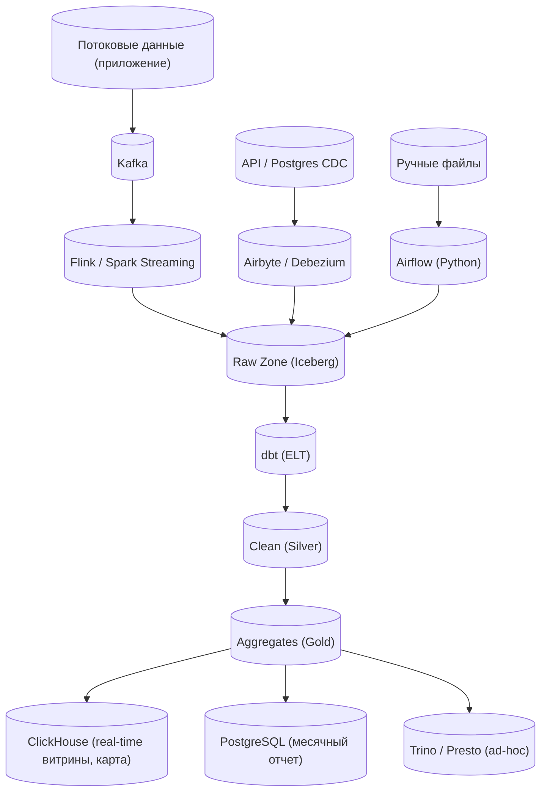
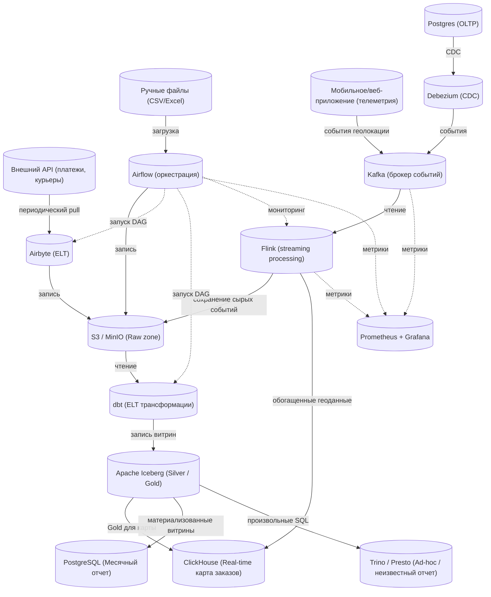

# Разбор кейса: «Построить ключевой отчет и аналитические витрины для маркетинговых аналитиков B2C сервиса»

## 1. Анализ требований (функциональные и нефункциональные)

### Функциональные требования (ФТ)
- **Поддержка ключевого отчета** – например, «эффективность каналов привлечения» (CAC, ROMI, LTV, конверсии по воронке).
- **Возможность строить аналитические витрины** – агрегированные данные для типовых разрезов:
  - по каналам/кампаниям/источникам трафика;
  - по времени (день, неделя, месяц);
  - по сегментам пользователей (новые / вернувшиеся, платформа, регион).
- **Детализация до событий** – при необходимости аналитик может «спуститься» к отдельным визитам, заказам, кликам.
- **Обновление данных** – ежедневно (инкрементально) с возможностью пересчета за произвольный период (data backfill).
- **Источники данных** (предполагаем):
  - сырые логи сервиса (события: page_view, add_to_cart, purchase);
  - данные из транзакционной БД (заказы, пользователи, продукты);
  - внешние данные (расходы на рекламу из API Яндекса, Google Ads).

### Нефункциональные требования (НФТ)
- **Доступность** – отчеты должны быть доступны 24/7, допустимый даунтайм < 1 часа в месяц.
- **Производительность** – отчет за последние 30 дней открывается < 3 секунд, витрина с месячной агрегацией строится < 15 минут.
- **Масштабируемость** – сервис B2C, > 1 млн DAU, десятки миллиардов событий в месяц.
- **Отказоустойчивость** – обработка данных должна продолжать работу при сбое отдельных компонентов (retry, checkpointing).
- **Экономичность** – минимизация вычислительных затрат и стоимости хранения (например, партиционирование, сжатие, выбор подходящих форматов).
- **Безопасность** – разграничение доступа к витринам (аналитики не видят сырые логи других команд).

## 2. Высокоуровневая архитектура

Выбираем **Medallion Architecture** (Bronze → Silver → Gold) на основе lakehouse-подхода, так как он гибок, дешев для хранения и позволяет распределенную обработку.

```mermaid
graph TD
    A[Источники данных] --> B[Ingestion]
    B --> C[Bronze (raw)]
    C --> D[Silver (clean, enriched)]
    D --> E[Gold (витрины, отчеты)]
    E --> F[Serving layer]
```

- **Bronze** – сырые данные в исходном формате (append-only, партиции по дате).
- **Silver** – очищенные, нормализованные, с дедупликацией, приведенные к единой схеме (SCD Type 2 для измерений).
- **Gold** – агрегированные витрины (star schema) и денормализованные таблицы для BI.

**Компоненты:**
- **Orchestration** – Apache Airflow (управление DAG-ами, backfill, мониторинг).
- **Ingestion** – Kafka (для потоковых событий) + dlt / Airbyte (для БД и API, batch).
- **Storage** – S3 (или HDFS) + табличный формат **Delta Lake** (ACID, time travel, Z-order).
- **Processing** – Spark (PySpark) для ETL/ELT в Bronze→Silver→Gold.
- **Serving** – Trino (или Presto) для интерактивных запросов + возможно PostgreSQL для малых витрин/метаданных.
- **BI** – Superset / Tableau / Power BI, подключается к Trino.

## 3. Модель данных

### Bronze слой
- Таблица `events_raw` – партиции по `event_date`, формат Parquet, поля: `event_id, user_id, session_id, event_type, event_time, raw_json`.
- Таблица `orders_raw`, `users_raw` – снапшоты из OLTP.

### Silver слой
- **Измерения**:
  - `dim_user` (user_id, first_visit_date, last_active_date, segment, platform, region) – SCD Type 2 только для критических изменений.
  - `dim_channel` (channel_id, source, medium, campaign, ad_group).
  - `dim_date` – классическая таблица дат.
- **Факты**:
  - `fact_visits` (session_id, user_id, visit_start, visit_end, channel_id, landing_page).
  - `fact_events` (event_id, user_id, event_time, event_type, product_id, amount, ...).
  - `fact_orders` (order_id, user_id, order_date, total_amount, status).

### Gold слой – витрины для маркетинга
**Витрина 1: «Ежедневная эффективность каналов»** (star schema)
- `marketing_daily_agg`:
  - `date, channel_id, user_type (new/returning)`
  - `impressions, clicks, cost, orders, revenue, cac, romi`
- **Расчеты**:
  - CAC = cost / new_users
  - ROMI = (revenue - cost) / cost
  - LTV (прогнозный) – отдельно, можно вынести в отдельную витрину.

**Витрина 2: «Воронка конверсии по каналам»** (широкая таблица)
- `funnel_daily`:
  - `date, channel_id, users_visit, users_add_to_cart, users_purchase, conversion_rate_visit_to_purchase`

**Отчет «Ключевые метрики»** – может быть материализованным представлением или отдельной витриной с агрегацией по месяцам.

## 4. Технологический стек и обоснование

| Компонент       | Выбор                  | Альтернативы            | Обоснование                                                                 |
|----------------|------------------------|-------------------------|-----------------------------------------------------------------------------|
| Хранилище      | Delta Lake on S3       | Iceberg, Hudi           | ACID, time travel, компактный, отличная интеграция со Spark, зонирование (Z-order) по date+channel_id для ускорения фильтрации |
| Обработка      | Spark (PySpark)        | Dask, Flink             | Де-факто стандарт для batch и micro-batch, масштабируется горизонтально, дешевле Snowflake при большом объеме |
| Оркестрация    | Airflow                | Prefect, Dagster        | Зрелый, много коннекторов, легко делать backfill, мониторинг через UI        |
| Потоковая часть| Kafka + Structured Streaming | Pulsar + Flink    | Kafka – отказоустойчивый брокер, Spark Structured Streaming – единый стек с batch, checkpointing в Delta |
| Serving        | Trino                  | Athena, ClickHouse      | Trino – federated queries, можно читать прямо из Delta, низкий latency (секунды) для интерактивных отчетов |
| BI             | Superset               | Tableau                 | Open source, хорошо работает с Trino, embedding в портал аналитики           |

## 5. Потоки данных (Data Flow)

1. **События из веб/мобильного приложения** → **Kafka** (топики: `events`, `pageviews`, `purchases`).
   - Spark Streaming читает из Kafka, пишет в **Bronze** (микро-батчи каждые 5 минут).
2. **Транзакционные данные (PostgreSQL)** → **Airbyte** (CDC или full refresh раз в час) → **Bronze**.
3. **Расходы на рекламу (API)** → Python-оператор в Airflow → **Bronze** (партиции по дате).
4. **Silver-слой** (Spark batch, запуск каждые 30 минут):
   - Чтение из Bronze за последние 2 часа.
   - Очистка (дедупликация по `event_id`, валидация схемы, обогащение user_id из справочника).
   - Запись в Silver с использованием `merge` (Delta) для медленно меняющихся измерений.
5. **Gold-слой** (Spark batch, запуск после Silver, 1 раз в день в 2 AM):
   - Построение витрин из Silver (фильтр по датам, агрегации, join с измерениями).
   - Использование оконных функций для LTV (rolling cohort analysis).
   - Запись в Delta-таблицы Gold с оптимизацией (Z-order по `date`, `channel_id`).
6. **Serving** – аналитик через BI делает запрос к Trino, который читает Gold-таблицы (при необходимости подтягивает свежие данные из Silver в real-time).

## 6. Детали ключевых компонентов и алгоритмов

### А) Расчет LTV (пример упрощенного алгоритма)
- В Silver есть `fact_orders` и `dim_user` с датой регистрации.
- В Gold витрина `cohort_ltv`:
  - Группируем пользователей по когорте (месяц регистрации).
  - Для каждого пользователя суммируем revenue за n месяцев.
  - Усредняем по когорте.
  - **Обоснование**: классический подход, легко интерпретировать, можно считать раз в месяц. Для онлайн-прогноза – отдельный ML-сервис (за рамками).

### Б) Обеспечение отказоустойчивости
- **Checkpointing** в Spark Streaming – при сбое восстановление ровно один раз (exactly-once) за счет idempotent записей в Delta.
- **Airflow retries** – для задач с API рекламных сетей (3 попытки с экспоненциальной задержкой).
- **Репликация данных** – S3 автоматически реплицирует данные между AZ.
- **Dead Letter Queue** – некорректные события пишутся в отдельную таблицу Bronze `dead_events` для последующего анализа.

### В) Производительность и оптимизация затрат
- **Партиционирование** Bronze по `event_date` – быстрое удаление старых данных (например, храним 3 месяца сырых логов, остальное – в архив).
- **Z-order** в Gold по полям, часто используемым в фильтрах (`date`, `channel_id`) – сокращает количество читаемых файлов на 70%.
- **Ваккум** Delta-таблиц раз в неделю (удаление старых версий).
- **Автомасштабирование** Spark-кластера (например, EMR Serverless) – платим только за время обработки.

### Г) Модель данных – почему не Data Vault?
Data Vault удобен для enterprise-хранилищ с частыми изменениями источников, но для маркетинговой витрины B2C он избыточен: больше джойнов, сложнее агрегации, выше затраты. Выбрали **звезду** для Gold – простота, скорость, понятность аналитикам.

## 7. Компромиссы и альтернативы (вопросы рекрутеру)

- **Почему не ClickHouse?** – ClickHouse отлично подходит для интерактивных агрегатов, но хуже справляется с частыми обновлениями и сложными трансформациями. Мы используем Trino + Delta, чтобы сохранить единый формат данных и упростить ETL.
- **Batch vs Streaming** – для ключевого отчета (ежедневная аналитика) достаточно batch-обработки. Если потребуется real-time отчетность, добавим Flink или Kafka Streams для отдельной витрины (минута задержки).
- **Как быть с GDPR / Right to be forgotten?** – В Delta Lake можно удалить данные пользователя из всех слоев через `delete` с сохранением ACID, но это дорого. Лучше сделать флаг `is_deleted` в `dim_user` и фильтровать в витринах.
- **Мониторинг качества данных** – предлагаю добавить Great Expectations в пайплайн: проверки на полноту, уникальность ключей, допустимые значения.

## 8. Итоговое резюме

Предложенное решение:
- **Масштабируемо** (горизонтально, lakehouse на S3 + Spark).
- **Экономично** (используем открытые форматы и serverless compute, платим только за ресурсы).
- **Отказоустойчиво** (репликация, checkpointing, retries).
- **Понятно аналитикам** (звездообразные витрины + BI).

В рамках секции я бы:
1. Нарисовал диаграмму компонентов на Miro.
2. Объяснил выбор каждого элемента, сравнив с альтернативами.
3. Показал пример SQL-запроса для витрины `marketing_daily_agg` (группировка по дате и каналу).
4. Обсудил, как будем тестировать производительность на объёме 100 млрд событий.


# Разбор кейса: «Архитектура для гетерогенных источников и разнородных отчетов»

## 1. Анализ требований

### Входные источники данных

| Источник | Тип данных | Регламент | Особенности |
|----------|------------|-----------|--------------|
| Мобильное/веб-приложение | Потоковые события (геолокация, статусы заказов) | Real-time (Kafka/WebSocket) | Высокая частота, до 10k событий/сек, критична задержка для карты |
| Внешний API (например, платежная система, курьерская служба) | REST API, ответы JSON | Периодический опрос (каждые 5-15 мин) | Rate limits, возможные сбои, идемпотентность |
| Postgres (транзакционная БД) | Таблицы: заказы, пользователи, продукты | CDC (Debezium) или ежечасный инкремент | Нельзя нагружать OLTP тяжелыми выборками |
| Ручные файлы | Excel/CSV (бюджеты, планы, корректировки) | Непериодически, загрузка через UI | Нет гарантий формата, возможны ошибки |

### Выходные отчеты (потребители)

| Отчет | Требования | SLA | Особенности |
|-------|------------|-----|--------------|
| **Месячный отчет** (финансы, метрики) | Фиксированный набор показателей, строго 5-го числа в 09:00 | Высокий (business-critical) | Нужна надежность, возможность пересчета (backfill), версионность |
| **«Онлайн» телеметрия для карты заказов** | Задержка < 2 секунды, отображение текущих заказов на карте города | Real-time (soft) | Высокая нагрузка на запись/чтение, фильтрация по геозонам |
| **Ежедневный отчет о доходах** | Агрегированные доходы по дням/каналам/регионам | Жесткий (каждый день к 10:00) | Инкрементальный расчет, экономичность |
| **Неопределенный отчет** («бизнес сам не знает чего хочет») | Гибкий ad-hoc анализ, возможность исследовать данные в любых разрезах | Низкий (можно перезапустить) | Требует хранения всех детализированных данных + инструментов самопомощи (SQL, BI) |

### Нефункциональные требования (выводятся из контекста)

- **Надежность** – месячный отчет должен быть гарантированно построен даже при сбоях (retries, alerting).
- **Масштабируемость** – поддержка роста числа заказов до 1 млн/день.
- **Отказоустойчивость** – дублирование критических компонентов, no single point of failure.
- **Гибкость** – возможность добавлять новые источники и метрики без перестройки пайплайнов.
- **Экономичность** – не хранить бесконечно сырые данные, использовать tiered storage.

## 2. Высокоуровневая архитектура

Выбираем **гибридную архитектуру** (Lambda + Data Lakehouse), которая разделяет потоки на **batch** (для надежности и пересчетов) и **streaming** (для малой задержки).  
Все данные стекаются в единое озеро (S3) с табличным форматом **Iceberg** (или Delta Lake), что дает ACID, time travel, partition evolution.




**Компоненты:**
- **Оркестрация** – Apache Airflow (управление DAG-ами, backfill, мониторинг).
- **Потоковый ingestion** – Kafka (брокер) + Flink (для сложной оконной обработки) или Spark Structured Streaming.
- **Пакетный ingestion** – Airbyte (для API и Postgres), собственные операторы Airflow для файлов.
- **Хранилище данных** – S3 (или MinIO) + Apache Iceberg (табличный формат).
- **Трансформации** – dbt (SQL-трансформации в Iceberg, от Silver до Gold).
- **Сервинг real-time** – ClickHouse (отличные запросы с группировкой по координатам, поддержка геоиндексов).
- **Сервинг batch-отчетов** – PostgreSQL (материализованные представления для месячного отчета, простота резервного копирования).
- **Ad-hoc** – Trino (запросы прямо к Iceberg, поддержка SQL, федерация).
- **BI / Визуализация** – Superset или Metabase (подключается к ClickHouse, PostgreSQL, Trino).

## 3. Обоснование выбора технологий

| Компонент | Выбор | Почему не другое |
|-----------|-------|------------------|
| Потоковая обработка | **Flink** (или Spark Streaming) | Flink дает true event-time processing, stateful оконные агрегации, низкую задержку. Spark – хорош, если команда знает PySpark, но задержка выше. Для карты заказов критична задержка < 2с – выбираем Flink. |
| Хранение сырых данных | **S3 + Iceberg** | Iceberg поддерживает evolution схемы, скрытые партиции, time travel – нужен для пересчета месячного отчета. Альтернатива Delta Lake – аналогичен, но Iceberg лучше работает с Trino и Flink. |
| CDC из Postgres | **Debezium + Kafka** | Не грузим OLTP, идемпотентность, легко восстанавливаем поток. |
| API-источники | **Airbyte** (Python-коннекторы) | Много готовых коннекторов, поддержка rate limiting, checkpointing. |
| Трансформации | **dbt** | Декларативный SQL, тестирование данных, документация, легко переиспользовать логи для batch и streaming (через материализацию таблиц). |
| Real-time витрина (карта) | **ClickHouse** | Гео-функции, высокая скорость вставки/выборки, сжатие, экономия ресурсов. PostgreSQL не выдержит 10k запросов в секунду с фильтрацией по полигонам. |
| Месячный отчет | **PostgreSQL** (материализованная витрина) | Простой, надежный, умеет делать dump/restore. Месячный отчет не требует сверхвысокой производительности, но гарантия целостности важнее. |
| Неопределенный отчет | **Trino + Iceberg** | Аналитики могут писать произвольные SQL по всем данным (Bronze/Silver/Gold). Trino federated – может джойнить с ClickHouse или PostgreSQL, если нужно. |

## 4. Потоки данных (Data Flow)

### 4.1 Потоковые данные (телеметрия заказов для карты)
1. Мобильное приложение отправляет событие `order_location_update` (order_id, lat, lon, status, timestamp) в **Kafka** (топик `orders_geo`).
2. **Flink** читает из Kafka, обогащает (например, присоединяет `order_id` к курьеру из KV store Redis), делает оконную агрегацию (актуальные заказы за последние 10 минут).
3. Результат пишет в **ClickHouse** в таблицу `current_orders_map` (с движком `ReplacingMergeTree` для обновлений).
4. Бэкенд карты делает HTTP-запрос к ClickHouse (или через WebSocket) и отображает точки.

### 4.2 Пакетные источники (API, Postgres, файлы)
- **Postgres** → Debezium → Kafka → Flink (или Spark) → **Iceberg** (таблица `orders_raw`, `users_raw`).
- **API** (платежи) → Airbyte (pull каждые 15 мин) → **Iceberg** (таблица `payments_raw`).
- **Ручные файлы** → загрузка в web-портал → Airflow запускает Python-скрипт валидации → запись в **Iceberg** (таблица `budgets_manual`).

### 4.3 Трансформации (dbt)
- **Silver** (чистый слой): дедупликация, приведение типов, SCD для измерений (`dim_courier`, `dim_restaurant`).
- **Gold для месячного отчета**:
  - Витрина `monthly_finance_agg` – агрегация по месяцам: доходы, расходы, количество заказов, средний чек.
  - Материализованная таблица в **PostgreSQL** (через dbt-оператор `postgres`).
- **Gold для ежедневного отчета**:
  - `daily_revenue` – таблица в Iceberg (или в ClickHouse, если нужна быстрота).
  - Ежедневный DAG в Airflow запускает dbt-модель, инкрементально обновляя данные за вчера.

### 4.4 Обеспечение SLA месячного отчета (5-е число 09:00)
- DAG в Airflow с расписанием `0 2 5 * *` (5-го числа в 2 часа ночи).
- Шаги:
  1. Проверить наличие данных за предыдущий месяц во всех источниках (API, Postgres, файлы) – если нет, отправить алерт и подождать ретрая.
  2. Запустить dbt-модели для пересчета Silver (только нужные партиции месяца).
  3. Вычислить витрину `monthly_finance_agg` в Iceberg.
  4. Экспортировать результат в PostgreSQL (или создать материализованное представление).
  5. Выполнить проверки (Great Expectations) – итоговая сумма должна сходиться с контрольными цифрами.
  6. Отправить уведомление в Slack/email.
  7. Если что-то пошло не так – повторить шаги 2-5, сохраняя предыдущую версию (time travel Iceberg).

## 5. Детали реализации ключевых компонентов

### 5.1 Real-time карта заказов (телеметрия)
- **ClickHouse таблица**:
  ```sql
  CREATE TABLE current_orders_map (
      order_id UInt64,
      lat Float64,
      lon Float64,
      status String,
      last_update DateTime,
      ...
  ) ENGINE = ReplacingMergeTree(last_update)
  ORDER BY (order_id);
  ```

- **Flink job**:
  - Source: Kafka, Watermark по event-time.
  - Key by `order_id`, окно `tumbling(10 seconds)` – берем последнее состояние.
  - Sink: ClickHouse с upsert-запросом (`ALTER TABLE ... UPDATE` или через буфер).

### 5.2 Неопределенный отчет (гибкий ad-hoc)
- Аналитики получают доступ к Trino, который подключен к Iceberg-таблицам (Bronze, Silver, Gold).
- Trino позволяет выполнять SQL-запросы к историческим данным (даже за несколько лет) с произвольными фильтрами и агрегациями.
- Для визуализации – Superset, где можно построить дашборд "песочница" с возможностью drag-and-drop полей.
- Плюс: можно использовать **dbt explorer** для исследования линий трансформаций.

### 5.3 Ежедневный отчет о доходах
- Инкрементальная модель dbt:
  ```sql
  {{ config(materialized='incremental', unique_key='date') }}
  SELECT date, SUM(revenue) as daily_revenue, ...
  FROM {{ ref('silver_orders') }}
  
    WHERE date >= (SELECT max(date) FROM {{ this }})
  
  GROUP BY date
  ```
- Материализация в ClickHouse (для быстрых ежедневных запросов) и в PostgreSQL (для долгосрочного архива).

# 6. Обеспечение требований по надежности и отказоустойчивости

| Сценарий | Решение |
|----------|---------|
| Сбой API-источника | Airbyte – exponential backoff, dead letter queue (сохраняем сырые ответы в S3). |
| Падение Flink job | Checkpointing в S3, автоматический перезапуск (Kubernetes + Operator). |
| Postgres репликация отстает | Debezium offsets в Kafka, можно воспроизвести с любой точки. |
| Месячный отчет не успел к 09:00 | Airflow SLA miss → алерт + запуск fallback-задачи (использовать предыдущую версию из Iceberg time travel). |
| Коррупция данных в файле | Перед записью в Iceberg – валидация схемы, если ошибка – файл в карантин. |

## 7. Компромиссы и альтернативы (для обсуждения с рекрутером)

- **Почему не единая система (например, Snowflake)?** – Снежинка дорога для high-throughput streaming, не умеет дешево хранить сырые логи. Наш подход дешевле и гибче.
- **Почему ClickHouse + PostgreSQL, а не одна СУБД?** – ClickHouse плохо подходит для частых обновлений и транзакций; PostgreSQL – для real-time аналитики. Разделение ролей оптимально.
- **Что если неизвестный отчет потребует real-time?** – Тогда добавим материализованные представления в ClickHouse под конкретные вопросы бизнеса. Но сначала ad-hoc через Trino.
- **Как быть с GDPR/удалением данных?** – Iceberg поддерживает `DELETE` с сохранением ACID, но дорого. Лучше помечать `is_deleted` и фильтровать.

## 8. Итоговая схема (текстовое описание для рисования на Miro)



Все DAG-и оркестрируются Airflow, мониторинг – Prometheus + Grafana, алерты – в Opsgenie.

**Резюме:** Предложенная архитектура закрывает все требования: реальное время для карты, жесткий SLA для месячного отчета, инкрементальность для ежедневного, и гибкость для неизвестного отчета за счет lakehouse + Trino.