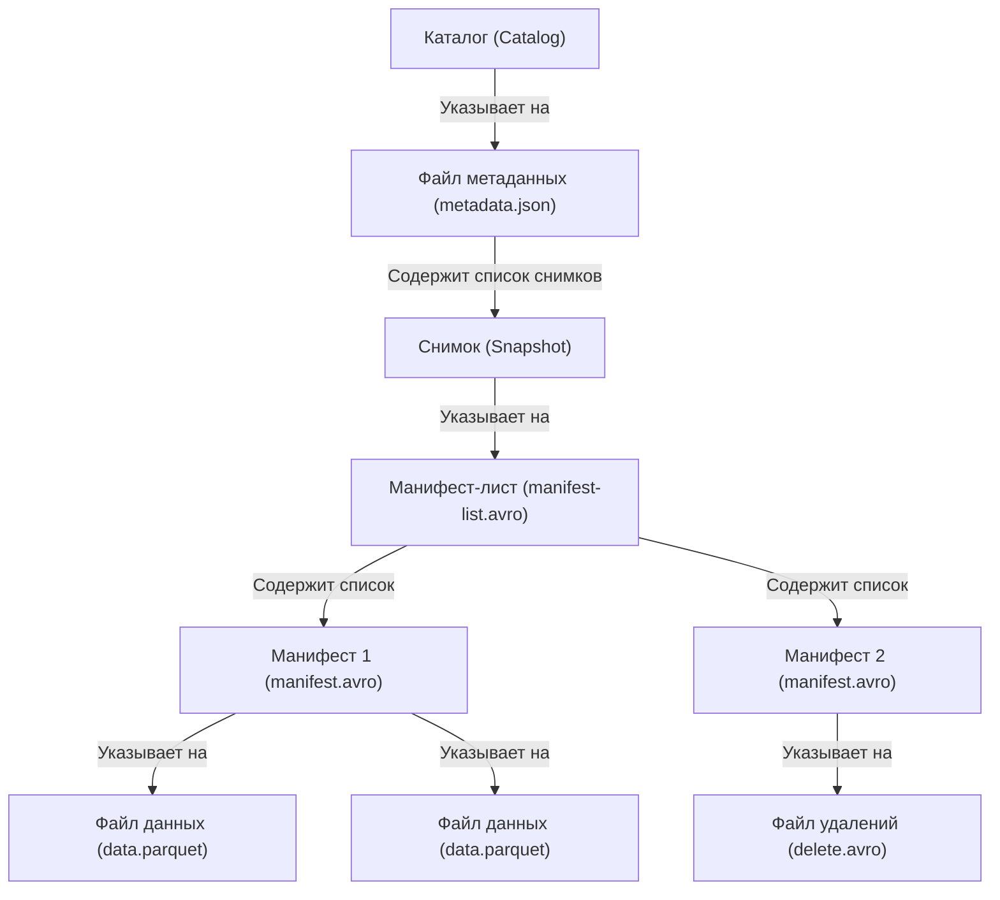

# ETL общее

## Что такое ETL и ELT? В чем разница между ними? Как к этому относится DataLake и DWH?

**ETL (Extract, Transform, Load)** – данные извлекаются из источника, преобразуются в промежуточном движке (очистка, агрегация, обогащение), затем загружаются в хранилище (DWH).  
**ELT (Extract, Load, Transform)** – данные сначала загружаются в целевую систему в сыром виде, а трансформации выполняются уже внутри неё (например, Snowflake, BigQuery, PostgreSQL).  

**Разница** – в месте и порядке выполнения трансформаций. ETL требует отдельного мощного сервера для преобразований, ELT – мощного целевого DWH.  

**DataLake** – хранилище неструктурированных и полуструктурированных данных (JSON, Parquet, Avro) в исходном виде. Обычно лежит на дешёвом объектном хранилище (S3, HDFS). Не накладывает схему при записи (schema-on-read).  

**DWH (Data Warehouse)** – структурированное хранилище, оптимизированное для аналитики (звёздная схема, снежинка). Данные очищены, согласованы, имеют схему при записи.  

Соотношение: DataLake часто используется как staging-зона в ELT (сырые данные → загрузка в озеро → трансформация в DWH). LakeHouse совмещает оба подхода.

## Какие бывают подходы к выделению инкремента? Что такое CDC?

**Инкремент** – загрузка только изменённых с прошлого раза данных, а не всей таблицы.

**Подходы к выделению инкремента**:
1. По дате / timestamp (столбец `last_modified`). Просто, но требует надёжности времени.
2. По возрастающему идентификатору (ID) – храним последний загруженный ID.
3. **Change Data Capture (CDC)** – технология отслеживания изменений на источнике (INSERT, UPDATE, DELETE) на уровне лога транзакций. Примеры: Debezium, Oracle GoldenGate, AWS DMS.
4. Триггеры или флаги (`is_deleted`).
5. Сравнение полных снимков (full diff) – медленно.

**CDC** – метод захвата изменений из транзакционного лога. Позволяет получать не только дельту, но и тип операции, что необходимо для SCD2 и поддержки актуальности.

## Какие бывают виды инкрементальной загрузки? Как организованы и в каких случаях применяются? Разница между SCD1 и SCD2?

**Виды инкрементальной загрузки**:
- **Append only** – только новые строки (логи, события). Просто, быстро.
- **Upsert (Merge)** – новые строки + обновление существующих. Используется при SCD1.
- **SCD2 (Slowly Changing Dimension Type 2)** – сохраняется история изменений: строке добавляются поля `valid_from`, `valid_to`, `is_current`. Применяется, когда важна история (например, изменение тарифного плана клиента).
- **Delta (изменения из CDC)** – обрабатываются события вставки/обновления/удаления.

**SCD1** – перезаписывает значение, история теряется. Простой, быстрый.  
**SCD2** – хранит все версии записи с интервалами действия. Требует больше места и логики слияния (merge с закрытием старых версий).

**Применение**:
- SCD1: для атрибутов, где история не нужна (например, исправление опечатки в имени).
- SCD2: для атрибутов, по которым нужно строить отчёты на любую дату в прошлом (например, адрес доставки, менеджер клиента).

## Где и в каких случаях лучше выполнять трансформации: на источнике, на приёмнике, на ETL-движке?

| Место | Когда лучше | Пример |
|-------|-------------|--------|
| На источнике | Источник мощный, данные нужно сильно фильтровать до передачи (снижение объёма). | `SELECT ... WHERE date > ...` в OLTP, чтобы не тащить всё. |
| На приёмнике (DWH) | DWH мощный (MPP, колоночный), трансформации сложные, используют SQL. | Snowflake, BigQuery, ClickHouse. |
| На ETL-движке (Spark, Dataflow) | Данные большие, источник/приёмник слабые, нужна распределённая обработка, работа с неструктурированными данными. | Spark-задачи с окнами, агрегациями, обогащение из нескольких источников. |

Комбинируют: фильтрация на источнике → лёгкая нормализация на движке → сложная бизнес-логика в DWH (ELT).

# ETL-инструменты

## Что такое Spark? (детально: RDD, DataFrame, Dataset, Scala, PySpark, Catalyst Optimizer, физические типы JOIN)

**Apache Spark** – распределённый движок для обработки больших данных, использующий in-memory вычисления и DAG (Directed Acyclic Graph) выполнения. Написан на Scala, работает на JVM.

### Основные абстракции данных в Spark

| Абстракция | Описание | Типизация | Оптимизация | Языки |
|------------|----------|-----------|-------------|-------|
| **RDD** | Низкоуровневая, распределённая коллекция объектов, разделённая на партиции. Поддерживает ленивые трансформации (map, filter, reduceByKey). Нет схемы. | Не типизирован | Нет (только lineage) | Scala, Java, Python |
| **DataFrame** | Распределённая таблица с именованными столбцами и схемой. Построен поверх RDD, использует Catalyst Optimizer. | Не типобезопасен (runtime) | Catalyst + Tungsten | Scala, Java, Python, R |
| **Dataset** | Типизированная версия DataFrame (например, `Dataset[Person]`). Сочетает оптимизации Catalyst с типобезопасностью. | Типобезопасен (compile-time) | Catalyst + Tungsten | Только Scala и Java |

**RDD** – фундамент Spark. Позволяет низкоуровневые операции, но не оптимизируется. Используется, когда нужен полный контроль (например, обработка неструктурированных данных).  
**DataFrame** – высокоуровневый API, рекомендуемый для большинства ETL. Имеет схему, поддерживает сотни встроенных функций.  
**Dataset** – гибрид. Доступен только в Scala/Java. В Python (PySpark) используется только DataFrame.

**Scala vs PySpark**:
- **Scala** – родной язык Spark. Даёт максимальную производительность, доступ ко всем API (Dataset, типизированные трансформации).
- **PySpark** – Python API. Удобен для аналитиков, но требует сериализации между JVM и Python (снижение производительности ~10-20%, но с Apache Arrow разница уменьшается).

### Catalyst Optimizer – оптимизатор запросов Spark

Catalyst – оптимизатор на основе правил и деревьев выражений. Проходит 4 фазы:

1. **Анализ** – проверка схемы, разрешение имён столбцов, приведения типов. Строится неоптимизированный логический план.
2. **Логическая оптимизация** – применяются правила:
   - `pushDown` фильтров (перенос `filter` перед `join`)
   - `column pruning` (удаление неиспользуемых столбцов)
   - `constant folding` (1+1 → 2)
   - `projection pushdown` (перенос `select` в источники)
   - перестановка join'ов (маленькую таблицу налево)
3. **Физическая оптимизация** – выбор физических операторов на основе статистики (размер таблиц, кардинальность). Здесь выбирается тип JOIN.
4. **Кодогенерация (Tungsten)** – генерация Java-байткода для выполнения запросов, управление памятью вне кучи (off-heap).

### Физические типы JOIN в Spark

Spark выбирает стратегию соединения на этапе физической оптимизации. Основные типы:

| Тип JOIN | Условие использования | Описание | Shuffle |
|----------|----------------------|----------|---------|
| **BroadcastHashJoin (BHJ)** | Одна таблица < spark.sql.autoBroadcastJoinThreshold (по умолч. 10 МБ) | Малая таблица рассылается на все Executor'ы (broadcast). Хэш-таблица строится на каждой партиции. Очень быстрый. | Нет |
| **SortMergeJoin (SMJ)** | Обе таблицы большие, ключ сортируемый | Обе стороны сортируются по ключу, затем сливаются (merge). По умолчанию для больших таблиц. | Да (shuffle + сортировка) |
| **ShuffledHashJoin (SHJ)** | Одна таблица помещается в память, но не broadcast (размер > threshold, но < memory) | Хэш-таблица строится для меньшей таблицы после shuffle. Требует достаточно памяти. | Да (только для меньшей таблицы) |
| **BroadcastNestedLoopJoin (BNLJ)** | Нет условий равенства (non-equi join) или очень маленькая таблица | Вложенные циклы, но с broadcast. Очень медленный, избегать. | Нет |

**Принудительный выбор JOIN**:
- `df1.join(df2.hint("broadcast"), condition)` – BHJ
- `df1.join(df2.hint("shuffle_hash"), condition)` – SHJ
- `df1.join(df2.hint("merge"), condition)` – SMJ

**Пример физического плана**:
```scala
df1.join(df2, "id").explain()
// == Physical Plan ==
// BroadcastHashJoin [id], BuildRight
// :- Scan parquet df1
// +- BroadcastExchange (HashedRelationBroadcastMode)
//    +- Scan parquet df2
```

## DBT - модели, шаблонизация SQL через Jinja, DAG, зависимости, ref(), проверки качества данных (unique, not_null, accepted_values), инкремент (unique_key)
**DBT (Data Build Tool)** — инструмент для трансформации данных по принципу ELT. Позволяет описывать аналитические преобразования в виде SQL-моделей, управлять порядком их выполнения, тестировать данные и документировать пайплайны.

### Модели
Модель в DBT — это SQL-файл (расширение `.sql`), который после 
выполнения превращается в таблицу или представление в целевой базе данных. 
Модели хранятся в директории `models/`. 

Пример:
```sql
-- models/customer_summary.sql
SELECT 
    customer_id,
    COUNT(order_id) AS total_orders,
    SUM(amount) AS total_spent
FROM {{ ref('stg_orders') }}
GROUP BY customer_id
```

Модели могут быть материализованы разными способами (задаётся через `{{ config(...) }}`):

- `view` — представление (легковесное, всегда актуально).
- `table` — физическая таблица (полностью пересоздаётся при каждой загрузке).
- `incremental` — инкрементальная таблица (добавляются только новые или изменённые строки).

### Шаблонизация SQL через Jinja

Jinja — шаблонизатор для создания динамического SQL. Основные конструкции:

- **Переменные**: `{{ var('my_variable', default_value) }}`
- **Условные операторы**:
```sql

    WHERE created_at > CURRENT_DATE - 30

```
- **Циклы**:
```sql

    {{ col }}, 

```
- **Макросы** (хранятся в `macros/`):
```sql

    TRIM(UPPER({{ column }}))

```

Использование: `SELECT {{ clean_string('name') }} FROM ...`

### DAG и зависимости (ref())
DBT автоматически строит **Directed Acyclic Graph (DAG)** зависимостей между моделями на основе функции `ref()`. 
Когда вы ссылаетесь на другую модель через `{{ ref('other_model') }}`, DBT:
1. Определяет, что текущая модель зависит от `other_model`.
2. Гарантирует, что `other_model` будет выполнена раньше.
3. Позволяет параллельно выполнять независимые ветки графа.

`ref()` также подставляет правильное имя таблицы/представления в целевом хранилище.

Пример:
```sql
-- model_a.sql
SELECT * FROM source_table

-- model_b.sql
SELECT * FROM {{ ref('model_a') }} WHERE status = 'active'
```

DBT построит граф: model_a → model_b.

### Проверки качества данных (tests)
Тесты описываются в YAML-файлах (например, `schema.yml`):
```yml
version: 2
models:
  - name: dim_customers
    columns:
      - name: customer_id
        tests:
          - unique
          - not_null
      - name: status
        tests:
          - accepted_values:
              values: ['active', 'inactive', 'banned']
```
- `unique` — уникальность
- `not_null` — отсутствие NULL
- `accepted_values` — допустимые значения

Кастомные тесты — SQL-запросы, возвращающие ошибочные строки, хранятся в `tests/`.

### Инкрементальные модели (incremental, unique_key)

Конфигурация инкрементальной модели:
```sql
{{
    config(
        materialized='incremental',
        unique_key='transaction_id',
        incremental_strategy='merge'   -- или 'append', 'insert_overwrite'
    )
}}

SELECT * FROM {{ ref('stg_transactions') }}

    WHERE created_at > (SELECT MAX(created_at) FROM {{ this }})

```

- `unique_key` — столбец (или комбинация) для идентификации строки, используется при merge.
- `incremental_strategy`: `'merge'` (upsert), `'append'` (только вставка), `'insert_overwrite'` (перезапись партиций).
- `is_incremental()` — макрос, возвращающий `True` при инкрементальном запуске.

## Что такое DAG? Зачем они нужны? Как создать DAG?

**DAG (Directed Acyclic Graph)** – ориентированный ациклический граф, где вершины — задачи, рёбра — зависимости (задача B зависит от A). В DAG нет циклов.

### Зачем:

- Определяет корректный порядок выполнения.
- Позволяет параллельно выполнять независимые ветки.
- Упрощает перезапуск только упавших подграфов.

### Создание:

- Программно: Airflow (Python, оператор `>>`).
- Декларативно: DBT (`ref()`), Makefile (цели и зависимости).
- Визуально: NiFi, Talend.

## Что такое Airflow? (детально: компоненты, Executor'ы, мониторинг, плагины, деплой в k8s)
**Apache Airflow** – платформа для оркестрации рабочих процессов на основе DAG.

### Компоненты
- **Scheduler** – планировщик, ставит задачи в очередь по расписанию.
- **Executor** – выполняет задачи. Типы:
  - *SequentialExecutor* (тесты)
  - *LocalExecutor* (многопроцессный на одной машине)
  - *CeleryExecutor* (распределённый, брокер RabbitMQ/Redis)
  - *KubernetesExecutor* (каждая задача в отдельном поде)
- *Web Server* – UI для мониторинга.
- *Metadata DB* (PostgreSQL/MySQL) – хранит состояния.
- *Worker* – процесс, выполняющий задачи (Celery).
- *Triggerer* – для асинхронных сенсоров.

### Мониторинг
- Web UI: tree, graph, Gantt, логи.
- CLI: `airflow dags list`, `airflow tasks test`.
- Prometheus + Grafana (через StatsD).
- Оповещения: email, Slack, PagerDuty.

### Плагины
Расширения: кастомные операторы (S3ToRedshift), хуки (Slack), сенсоры (S3KeySensor).

### Деплой в k8s
- Helm-чарт `apache-airflow`.
- `executor = KubernetesExecutor` – каждый task в отдельном поде.
- DAG-файлы через Git-sync sidecar или PVC.

## Что такое Kubernetes? Настройка подов, лимитов ресурсов, дебаг подов?
**Kubernetes** – оркестратор контейнеров.

**Настройка пода и лимитов** (YAML):
```yaml
apiVersion: v1
kind: Pod
spec:
  containers:
  - name: app
    image: myapp
    resources:
      requests: { memory: "512Mi", cpu: "250m" }
      limits:   { memory: "1Gi", cpu: "500m" }
```

- `requests` – минимальные ресурсы для размещения.
- `limits` – максимум (при превышении CPU – троттлинг, memory – OOM kill).

### Дебаг:
- `kubectl describe pod`
- `kubectl logs`
- `kubectl exec -it`
- `kubectl port-forward`

## Что такое Docker? Создание образа, запуск образа, просмотр имеющихся и запущенных образов? Что такое Docker Compose? Как запустить Docker-образ в Kubernetes?

**Docker** – контейнеризация.

- **Создание образа**: `Dockerfile` → `docker build -t name .`

- **Запуск**: `docker run -d --name c1 image`

- **Просмотр образов**: `docker images`

- **Просмотр контейнеров**: `docker ps, docker ps -a`

**Docker Compose** – многоконтейнерное приложение из YAML (`docker-compose.yml`). Запуск: `docker-compose up -d`.

**Запуск образа в K8s**: загрузить в registry → создать Deployment + Service → `kubectl apply`.

## Как мониторить производительность ETL?
Метрики: время выполнения, объём данных (строки/байты), CPU/RAM/I/O, частота ошибок, latency.

Инструменты: Airflow UI, Spark UI, Prometheus+Grafana, ELK, логгирование таймингов.

## Что делать, если ETL стал дольше работать?

1. Определить узкое место (extract/transform/load).
2. Проверить объём данных – возможно, нужен инкремент/партиционирование.
3. В Spark – проверить перекос данных (skew), добавить `repartition`, использовать broadcast join, увеличить память.
4. В SQL – оптимизировать индексы, избегать функций в WHERE, переписать оконными функциями.
5. В Airflow – увеличить количество worker'ов, настроить пулы, разбить DAG.
6. Перейти на CDC или микробатчи.

## Что такое Kafka? Producer, consumer, topic, offset?
**Apache Kafka** – распределённый брокер сообщений (pub/sub).

- **Topic** – канал, разделённый на партиции.
- **Producer** – пишет сообщения в topic (с ключом для партиционирования).
- **Consumer** – читает из topic, входит в consumer group (одна партиция на одного consumer).
- **Offset** – уникальный номер сообщения в партиции. Consumer коммитит offset для продолжения.

## Что такое RabbitMQ? Сценарии, типы обмена?

**RabbitMQ** – брокер на AMQP.

**Сценарии**: асинхронная обработка, буферизация, балансировка.

**Типы обменников (exchange)**: Direct (точное совпадение routing key), Fanout (broadcast), Topic (wildcard), Headers (по заголовкам).

# DWH
## Как устроен Hadoop?

Apache Hadoop — это программная платформа с открытым исходным кодом, предназначенная для 
хранения и обработки больших массивов данных на кластерах из стандартных серверов. 
Hadoop позволяет масштабироваться от одного сервера до тысяч машин.

### Философия Hadoop

Ключевой принцип архитектуры Hadoop заключается в том, что **перемещать вычислительные задачи к данным дешевле, 
чем перемещать сами данные**. Задачи выполняются на тех узлах кластера, где хранятся обрабатываемые данные, 
что минимизирует сетевой трафик. Hadoop основан на концепции горизонтального масштабирования (scale-out), 
когда нагрузка распределяется между несколькими серверами.

Отказы при обработке информации рассматриваются как норма, а не исключение. 
Надежность достигается за счёт избыточности данных и автоматического восстановления при сбоях.

### Основные компоненты Hadoop

Ядро Hadoop состоит из трёх ключевых компонентов:

#### 1. Hadoop Distributed File System (HDFS)

HDFS — распределённая файловая система, обеспечивающая хранение больших объёмов данных и доступ к ним. 
Она разделяет данные на блоки и распределяет их по узлам кластера, обеспечивая отказоустойчивость 
и параллельную обработку.

**Архитектура HDFS** построена по модели "главный-подчиненный" (master-slave):

- **NameNode** — главный узел (master). Он управляет пространством имён (метаданными), 
отслеживает местоположение всех блоков данных и обеспечивает доступность реплик. 
При сбое узла DataNode NameNode назначает другой узел для репликации блока, восстанавливая 
количество копий до требуемого порогового значения. В исходной архитектуре NameNode является единой 
точкой отказа (SPOF), однако можно назначить Secondary NameNode для периодического копирования метаданных.

- **DataNode** — рабочие узлы (workers), на которых хранятся реальные данные. 
DataNode взаимодействуют с NameNode для управления задачами хранения и репликации. 
Данные распределены по нескольким дискам, что обеспечивает высокий параллелизм операций. 
DataNode отправляют периодические heartbeat-сообщения (сигналы пульса) NameNode для подтверждения 
своей активности.

**Файлы в HDFS** разделены на блоки размером по умолчанию 128 МБ. 
Блоки реплицируются по умолчанию три раза по всему кластеру (коэффициент репликации). Политика хранения реплик:

- Первая реплика хранится на том узле, где находится клиент
- Вторая реплика хранится на DataNode в другой стойке
- Третья реплика хранится на DataNode в той же стойке, что и вторая

**HDFS Federation** — расширение, позволяющее иметь несколько независимых NameNode/пространств 
имён для горизонтального масштабирования и изоляции разных типов приложений. 
DataNodes при этом используются как общее хранилище блоков для всех NameNode.

#### 2. Hadoop YARN

YARN (Yet Another Resource Negotiator) — это система управления ресурсами кластера и планирования заданий. 
YARN управляет ресурсами в кластере Hadoop, планирует и мониторит выполнение задач.

**Архитектура YARN** построена на разделении функций управления ресурсами и планирования/мониторинга 
задач на отдельные компоненты:

- **ResourceManager (RM)** — глобальный главный процесс. Он управляет распределением ресурсов 
(память, CPU, диск, сеть) между всеми приложениями в системе. ResourceManager принимает задания, 
выделяет ресурсы в виде контейнеров и отвечает за запуск ApplicationMaster для каждого приложения. 
Для обеспечения высокой доступности (HA) ResourceManager может быть развёрнут на нескольких узлах.

- **NodeManager (NM)** — агент на каждом узле кластера. Он отвечает за управление контейнерами на своём узле, 
мониторинг использования ресурсов (CPU, память, диск, сеть) и передачу этой информации ResourceManager.

- **ApplicationMaster (AM)** — экземпляр, создаваемый для каждого приложения. 
AM отвечает за переговоры с ResourceManager о выделении ресурсов и взаимодействие с NodeManager 
для выполнения и мониторинга задач.

- **Container** — абстрактная единица ресурсов (память, CPU, диск, сеть), выделяемая приложению. 
ApplicationMaster запрашивает контейнеры у ResourceManager для выполнения своих задач.

- **Scheduler** — компонент ResourceManager, отвечающий за распределение ресурсов между приложениями. 
Поддерживаются различные планировщики (CapacityScheduler, FairScheduler), 
которые можно подключать через плагины.

#### 3. MapReduce

MapReduce — это модель программирования и обработки данных в Hadoop, которая позволяет разбить задачу обработки 
данных на небольшие части (map) и затем собрать результаты (reduce) на каждом узле кластера.

**Процесс выполнения MapReduce-задачи**:

1. **Task Submission** — пользователь отправляет MapReduce-задание через командную строку или API. 
Задание разбивается на Map и Reduce задачи.

2. **Resource Allocation** — ResourceManager (YARN) принимает задание, выделяет ресурсы и 
запускает ApplicationMaster, который координирует выполнение.

3. **Map Phase (Фаза отображения)**:
   - Input Splits: входные данные разделяются на логические части (обычно соответствующие блокам HDFS)
   - Mapper: каждая Map-задача обрабатывает свой сплит, создавая промежуточные пары "ключ-значение"
   - Промежуточные результаты записываются на локальный диск узла

4. **Shuffle and Sort Phase (Фаза перемешивания и сортировки)**:
   - Shuffle: выходы Map-задач передаются на узлы, где будут выполняться Reduce-задачи
   - Sort: промежуточные данные сортируются по ключам перед подачей в Reduce

5. **Reduce Phase (Фаза свертки)**:
   - Каждая Reduce-задача получает все значения для определённого ключа
   - Выполняется агрегация/обработка и запись результата в HDFS

6. **Completion and Cleanup** — после завершения всех задач ResourceManager отмечает задание выполненным, 
NodeManager очищают временные ресурсы.

### ZooKeeper в Hadoop

ZooKeeper — это сервис координации распределённых приложений, который играет ключевую роль в экосистеме Hadoop.

**Основные функции ZooKeeper в Hadoop**:
- **Высокая доступность (HA)** — обеспечивает автоматическое переключение NameNode и ResourceManager при сбоях.
- **Управление кластером** — управляет регистрацией узлов и контролирует их состояние через механизм heartbeat.
- **Конфигурация** — хранит и распространяет конфигурации по всем узлам.
- **Распределённые блокировки** — обеспечивает синхронизацию доступа к ресурсам.

### Экосистема Hadoop

Вокруг Hadoop сложилась обширная экосистема проектов, расширяющих его возможности:

| Компонент | Назначение |
|-----------|------------|
| **Apache Hive** | SQL-интерфейс для запросов к данным в HDFS. Преобразует SQL-запросы в MapReduce-задачи. |
| **Apache HBase** | Распределённое NoSQL-хранилище с произвольным доступом в реальном времени. Работает поверх HDFS. |
| **Apache Pig** | Язык высокого уровня для анализа данных, компилирующийся в MapReduce. |
| **Apache Oozie** | Система оркестрации для планирования и управления заданиями Hadoop. |
| **Apache Spark** | Быстрый движок для обработки данных, может работать как поверх YARN, так и самостоятельно. Не входит в ядро Hadoop, но тесно интегрирован. |
| **Apache Flume** | Сервис для сбора и агрегации потоковых данных (логов) в HDFS. |
| **Apache Sqoop** | Инструмент для импорта/экспорта данных между реляционными базами данных и HDFS. |

### Процесс чтения и записи в HDFS

**Чтение файла**:
1. Клиент обращается к NameNode за информацией о местоположении блоков файла.
2. NameNode возвращает список DataNode, на которых находятся блоки (с учётом близости к клиенту).
3. Клиент читает данные напрямую от DataNode, пытаясь выбрать ближайшую реплику.

**Запись файла**:
1. Клиент запрашивает у NameNode разрешение на создание файла.
2. NameNode создаёт запись в метаданных и возвращает клиенту список DataNode для записи.
3. Клиент отправляет данные первому DataNode, который реплицирует их дальше по цепочке.
4. После успешной записи всех блоков клиент уведомляет NameNode о завершении.

## Устройство Amazon S3

Amazon Simple Storage Service (S3) — это масштабируемое объектное хранилище, 
предоставляемое как сервис (Storage-as-a-Service) компанией AWS. 
Оно позволяет хранить и извлекать любой объём данных из любой точки мира через простой веб-интерфейс.

### Философия и основные концепции S3

Ключевая идея S3 — предоставить бесконечно масштабируемое, высокодоступное и долговечное хранилище с простым интерфейсом. 
В отличие от традиционных файловых систем, S3 не имеет иерархической структуры папок.

Основные понятия S3:

- **Объект (Object)** — базовая единица хранения в S3. Объект состоит из:
  - Файла (данных) произвольного формата
  - Метаданных (пары "ключ-значение", описывающие объект)
  - Уникального идентификатора — ключа объекта (Key)
  - Версии (если включено версионирование)
- **Бакет (Bucket)** — контейнер для хранения объектов. Бакет служит логической единицей 
группировки объектов и границей для управления доступом, мониторинга и настройки 
правил жизненного цикла.

Критическое ограничение: имя бакета должно быть **глобально уникальным** во всей экосистеме AWS 
(вне зависимости от региона и аккаунта).

### Архитектура и внутреннее устройство

#### 1. Плоское пространство имён и ключи объектов

S3 использует **плоское пространство имён**. Внутри бакета нет вложенных папок, как в файловой системе. 
Вместо этого каждый объект идентифицируется своим ключом (Key) — строкой, которая может включать 
символы-разделители (например, `/`), создавая иллюзию иерархии для пользователя. 
Комбинация из имени бакета, ключа объекта и ID версии (если используется) однозначно 
идентифицирует каждый объект в S3.

#### 2. Региональность и репликация

Каждый бакет создаётся в определённом **регионе** AWS, который задаётся при его создании и впоследствии не может 
быть изменён.

Внутри региона данные автоматически реплицируются на множество устройств и как минимум 
в три зоны доступности (Availability Zones). Это обеспечивает стандартную для S3 долговечность 
(durability) в 99.999999999% (11 девяток) и высокую доступность. 
Пользователь может управлять геораспределением своих данных с помощью правил репликации, 
которые в асинхронном режиме копируют объекты между бакетами в разных регионах или аккаунтах.

#### 3. Модель консистенции

Долгое время S3 полагался на модель **согласованности в конечном счёте (Eventual Consistency)**, 
где после успешной записи или обновления объекта последующий запрос на его чтение мог вернуть устаревшие данные.

Однако с декабря 2020 года Amazon перевёл S3 на модель **строгой согласованности 
(Strong Read-After-Write Consistency)** для всех операций. 
Это ключевое изменение было внедрено автоматически для всех приложений без необходимости изменения 
конфигурации и без ущерба для производительности или доступности:

- После успешной операции `PUT` объекта (как нового, так и перезаписывающего) последующая 
операция `GET` немедленно вернёт актуальную версию.
- После операции `DELETE` последующий запрос `GET` гарантированно не вернёт удалённый объект.
- Операции `LIST` также стали строго согласованными.

Исключения: модель конечной согласованности всё ещё может применяться к операциям управления 
бакетами (создание, удаление, листинг бакетов).

#### 4. Распределение нагрузки и шардирование (Partitioning)

Для обеспечения высокой производительности на петабайтных масштабах, S3 динамически шардирует 
данные по множеству серверов. Ключевым фактором производительности является **префикс ключа объекта**. 
S3 использует префиксы ключей для автоматического распределения данных по разным физическим партициям.

При параллельной нагрузке рекомендуется включать в ключ объекта случайную или хэшированную последовательность 
символов в качестве префикса. Это позволяет равномерно распределить нагрузку по множеству партиций и 
достичь пропускной способности в тысячи запросов в секунду на префикс. Ключевое ограничение, 
существовавшее в S3 долгое время, — ограничение на 3500 запросов `PUT`/`POST`/`DELETE` 
и 5500 запросов `GET`/`HEAD` в секунду на один префикс в бакете — было многократно увеличено и 
больше не является практическим ограничением. Сам S3 способен обрабатывать до 1 петабайта данных в секунду, 
разбивая объекты на тысячи частей и распределяя их по множеству дисков.

### Ключевые возможности и механизмы

#### 1. Классы хранения (Storage Classes)

S3 предоставляет несколько классов хранения для оптимизации затрат:

| Класс хранения | Оптимальное использование | Ключевые особенности |
|---|---|---|
| **S3 Standard** | Часто используемые данные | Высокая производительность, низкая задержка, репликация в трёх+ зонах |
| **S3 Intelligent-Tiering** | Данные с неизвестным или меняющимся доступом | Автоматически перемещает данные между четырьмя уровнями доступа: частый, нечастый, редкий и архивный |
| **S3 Standard-IA** | Долгоживущие, редко используемые данные | Цена хранения ниже, но есть плата за извлечение |
| **S3 One Zone-IA** | Некритичные, редко используемые данные | Хранится только в одной зоне доступности (дешевле, но ниже доступность) |
| **S3 Glacier Instant Retrieval** | Долгосрочный архив с доступом в миллисекундах | Немедленное извлечение, но ещё более низкая цена хранения |
| **S3 Glacier Flexible Retrieval** | Архив, извлекаемый несколько раз в год | Извлечение от минут до часов |
| **S3 Glacier Deep Archive** | Самое долгосрочное хранение (7-10+ лет) | Самый дешёвый, извлечение в течение 12 часов |

Все классы хранения, кроме `One Zone-IA`, реплицируют данные как минимум в трёх зонах доступности, 
обеспечивая 99.999999999% долговечности.

#### 2. Версионирование (Versioning)

Версионирование позволяет сохранять несколько вариантов одного объекта в бакете. 
Это обеспечивает защиту от случайных удалений или перезаписей:

- Каждый объект получает уникальный ID версии.
- Операции `DELETE` не удаляют объект физически, а добавляют маркер удаления (Delete Marker).
- Версионирование является обязательным условием для настройки репликации между бакетами.

#### 3. Репликация (Replication)

Репликация автоматически и асинхронно копирует объекты из одного бакета (источник) в другой (назначение). 
Это может быть использовано для:

- Улучшения долговечности и доступности данных
- Соблюдения географических и регуляторных требований
- Создания резервных копий в отдельном регионе или аккаунте
- Репликации в режиме, близком к реальному времени (S3 Replication Time Control, S3 RTC)

#### 4. Управление жизненным циклом (Lifecycle Policies)

Правила жизненного цикла позволяют автоматизировать переход объектов между классами хранения 
и их последующее удаление. Например, можно настроить правило для автоматического перемещения объектов 
в класс S3 Standard-IA через 30 дней, в S3 Glacier Deep Archive через 90 дней и окончательного удаления через 365 дней.

#### 5. Безопасность и контроль доступа

S3 предоставляет многоуровневую систему безопасности:

- **Базовый уровень**: IAM-политики на уровне пользователя или роли.
- **Уровень бакета**: Bucket Policies (JSON) — детализированные правила доступа для всего бакета или его части.
- **Уровень объекта**: Access Control Lists (ACL) — устаревающий, 
но всё ещё поддерживаемый механизм для управления доступом к отдельным объектам.
- **Pre-signed URLs**: временные URL-адреса для предоставления ограниченного доступа 
к объекту без раскрытия учётных данных.
- **Шифрование**: SSE-S3 (S3-managed keys), SSE-KMS (AWS KMS-managed keys), SSE-C (customer-provided keys) 
и клиентское шифрование.

### API и способы взаимодействия

S3 предоставляет RESTful API, который позволяет выполнять следующие типы операций:

- Операции с бакетами: создание, удаление, получение региона, листинг объектов, настройка политик и правил.
- Операции с объектами: `PUT`, `GET`, `DELETE`, `HEAD`, копирование, 
загрузка частями (multipart upload для объектов > 100 МБ).

API доступен через:
- AWS Management Console (веб-интерфейс)
- AWS CLI
- AWS SDKs (Python `boto3`, Java, JavaScript, Go, .NET, Ruby и др.)
- S3-совместимые протоколы (S3 API стал де-факто отраслевым стандартом, 
реализуемым другими облачными провайдерами и on-premise решениями).

### S3 vs HDFS: Сравнение с распределённой файловой системой Hadoop

S3 и HDFS представляют собой принципиально разные подходы к хранению данных:

| Характеристика | S3 | HDFS |
|---|---|---|
| **Модель хранения** | Объектное хранилище | Файловая система |
| **Пространство имён** | Плоское (глобальные уникальные бакеты) | Иерархическое (деревья папок) |
| **Консистенция** | Строгая согласованность (с 2020 года) | Строгая согласованность внутри файла |
| **Доступность при отказе** | Данные автоматически реплицируются в >=3 зонах доступности | При отказе NameNode кластер становится недоступен (SPOF) |
| **Привязка к вычислениям** | Вычисления и хранение полностью развязаны | Вычисления и хранение тесно связаны (Data locality) |
| **Масштабируемость** | Практически бесконечная (петабайты+) | Масштабируется добавлением узлов |
| **Производительность** | Ниже у HDFS на больших кластерах, но компенсируется параллелизацией | Выше на локальных данных |
| **Использование** | Озёра данных, бэкапы, статический контент | MapReduce, Spark-обработка на месте |
| **Стоимость** | Плата только за используемое хранилище и запросы | Требует постоянного содержания вычислительного кластера |
| **Жизненный цикл данных** | Автоматическое управление (переход между классами, удаление) | Ручное управление через скрипты |

Ключевое отличие заключается в привязке вычислений к данным: HDFS оптимизирован для перемещения вычислений к данным, 
что критически важно для MapReduce. S3, напротив, предназначен для полного разделения 
вычислительных ресурсов и хранилища, что даёт большую гибкость и экономическую 
эффективность за счёт оплаты только за фактически использованные ресурсы.

## Отличия Hadoop, S3 от Oracle/PostgreSQL/MS SQL?
**Hadoop** – экосистема (HDFS, YARN, MapReduce) для распределённого хранения и обработки.

**S3** – объектное хранилище AWS.

**Отличия от РСУБД**:

- РСУБД – ACID, индексы, SQL, единый сервер.
- Hadoop/S3 – огромные объёмы, неструктурированные данные, дешёвое масштабирование, 
ограниченная поддержка транзакций.

## Чем отличается хранилище данных от базы данных? Для чего используется?

| Характеристика                    | База данных (OLTP) | Хранилище данных (OLAP) |
|-----------------------------------|----------------------|----------|
| **Назначение**        | Транзакции | Аналитика, отчёты |
| **Нагрузка**        | Много мелких операций | Большие чтения, агрегации |
| **Нормализация**        | Высокая (3НФ) | Денормализация (звезда) |
| **Индексы**        | B-tree | Колоночные, битовые |
| **История**        | Только текущее состояние | Исторические данные (SCD) |

## Что такое DWH, DataLake, LakeHouse? В чём разница?

- **DWH (Data Warehouse)** – хранилище данных, предназначенное для структурированной аналитики. Данные проходят очистку, нормализацию/денормализацию, загружаются по строгой схеме (schema-on-write). Оптимизировано для сложных SQL-запросов, агрегаций и отчётов. Примеры: Snowflake, Amazon Redshift, Google BigQuery, Teradata.  
  *Особенности*: высокая производительность, поддержка ACID (в разной степени), но дорогое масштабирование и хранение.

- **DataLake (озеро данных)** – хранилище неструктурированных, полуструктурированных и структурированных данных в исходном виде. Данные хранятся в дешёвом объектном хранилище (S3, HDFS, ADLS) в форматах Parquet, Avro, JSON, ORC. Схема накладывается при чтении (schema-on-read).  
  *Особенности*: очень дёшево, масштабируемо, подходит для машинного обучения и потоковой обработки. Недостатки: отсутствие транзакций, низкая производительность аналитических запросов «из коробки», проблема «озера данных» (data swamp) из-за отсутствия управления.

- **LakeHouse (озеро-хранилище)** – архитектура, объединяющая преимущества DataLake и DWH. Поверх объектного хранилища используются табличные форматы (Apache Iceberg, Delta Lake, Apache Hudi), которые добавляют:
  - ACID-транзакции
  - временные путешествия (time travel)
  - эволюцию схемы и партиционирования
  - поддержку SQL и высокую производительность запросов (через движки типа Spark, Trino, Dremio)
  *Примеры*: Databricks Lakehouse, AWS Lake Formation с Iceberg, Google BigLake.

**Разница в таблице**:

| Характеристика | DWH | DataLake | LakeHouse |
|----------------|-----|----------|-----------|
| Тип данных | Структурированные | Любые (структ., полу-, неструкт.) | Любые |
| Схема | Schema-on-write | Schema-on-read | Schema-on-read + ACID |
| Транзакции ACID | Да (обычно) | Нет | Да (через форматы таблиц) |
| Производительность запросов | Высокая | Низкая (без доп. слоёв) | Высокая |
| Стоимость хранения | Высокая | Низкая | Низкая |
| Пример технологий | Snowflake, Redshift | S3 + Hive, ADLS | Iceberg + Trino, Delta Lake + Spark |

## Что такое Iceberg? Особенности, форматы, эволюция схемы, партиционирования, компакция
**Apache Iceberg** – табличный формат для Lakehouse, работающий поверх объектного хранилища (S3, HDFS). Обеспечивает ACID-транзакции, временные путешествия (time travel), эволюцию схемы без перезаписи данных.

### Ключевые особенности:

- **Snapshot isolation** – запись не мешает чтению, каждый запрос видит согласованный снимок.
- **Скрытое партиционирование** – партиции не зависят от физической структуры каталогов. Можно изменить схему партиционирования без перезаписи старых данных.
- **Эволюция схемы** – добавление, удаление, переименование столбцов, изменение типов (совместимых) без переписывания файлов.
- **Time travel** – возможность читать состояние таблицы на любой предыдущий момент (по snapshot ID или timestamp).
- **Быстрый планировщик** – метаданные содержат информацию о файлах, не нужно листинговать директории.

**Поддерживаемые форматы данных** (file formats): Parquet, ORC, Avro.

**Эволюция схемы (schema evolution)**: можно выполнять `ALTER TABLE ... ADD COLUMN`, 
`RENAME COLUMN`, `DROP COLUMN`. Iceberg хранит несколько версий схемы и сопоставляет их с файлами.

**Эволюция партиционирования (partition evolution)**: при изменении выражения партиционирования 
новые данные записываются по новым правилам, а старые остаются. 
Запросы, знающие текущую схему, автоматически читают оба типа партиций.

**Компакция (compaction)**: процесс объединения мелких файлов данных в более крупные для 
повышения производительности. Iceberg предоставляет процедуры `rewrite_data_files` и `rewrite_manifests`.

**Средства работы**: Spark (DataFrame, SQL), Flink, Trino, Dremio, AWS Athena, PyIceberg.

#### Структура файла Iceberg:
Iceberg организует данные в трёхуровневую иерархию, разделяя метаданные и собственно данные:

- **Каталог (Catalog)** — указывает на текущий файл метаданных.
- **Метаданные (Metadata)** — JSON-файлы, описывающие структуру таблицы, её партиции, историю снимков и ссылки на манифесты.
- **Манифест-листы (Manifest Lists)** — Avro-файлы, перечисляющие манифесты для конкретного снимка.
- **Манифесты (Manifests)** — Avro-файлы, содержащие список файлов данных с их статистикой (min/max, количество строк и т.д.).
- **Файлы данных (Data Files)** — реальные данные в форматах Parquet, Avro или ORC.

Ниже представлена схема, иллюстрирующая эту иерархию:



#### Жизненный цикл файлов
1. **Запись**:
   - Новые данные записываются в новые файлы данных.
   - Создаётся новый манифест, перечисляющий эти файлы.
   - Создаётся новый манифест-лист, включающий новый манифест (и, возможно, существующие).
   - Атомарно создаётся новый файл метаданных, указывающий на новый манифест-лист.
   - Указатель в каталоге обновляется на новый файл метаданных.

2. **Удаление**:
   - При DELETE Iceberg не переписывает существующие файлы данных. Вместо этого он создаёт файл удалений (position delete).
   - Создаются новые манифесты (со ссылками на файлы удалений) и новый снимок.

3. **Очистка**:
   - Устаревшие снимки можно удалять командой `expire_snapshots`.
   - Файлы, на которые никто не ссылается (сиротские файлы), удаляются через `remove_orphan_files`.
   - Мелкие манифесты можно переписать (оптимизировать) через `rewrite_manifests`.

## Что такое Parquet и какие у него особенности? Что такое Avro и какие у него особенности?

### Parquet
**Parquet** – колоночный формат хранения данных, оптимизированный для аналитических запросов. 
Разработан в Twitter и Cloudera.

#### Особенности:

- **Колоночное хранение** – данные каждого столбца хранятся вместе. 
При чтении запрос может прочитать только нужные столбцы (projection pushdown), что уменьшает I/O.
- **Сжатие и кодирование** – колонки одного типа хорошо сжимаются (Snappy, GZIP, ZSTD) и 
кодируются (RLE, dictionary encoding). Например, для столбца с повторяющимися значениями 
применяется словарь.
- **Вложенные структуры** – поддерживает сложные типы (массивы, структуры, карты) без flattening.
- **Схема встроена** – метаданные содержат схему, статистику (min/max) для каждого блока, 
что позволяет делать predicate pushdown.
- **Эффективен для аналитики** – идеален для SELECT с агрегациями и фильтрацией.

#### Структура файла Parquet:

- Заголовок (магическое число "PAR1")
- Row groups (набор строк, разделённых на колоночные чанки)
- Колоночные чанки сжаты и содержат страницы
- Footer со схемой, статистикой, метаданными

#### Пример схемы и записи в Parquet (через PySpark):
```python
# Схема
from pyspark.sql.types import StructType, StructField, StringType, IntegerType
schema = StructType([
    StructField("id", IntegerType(), True),
    StructField("name", StringType(), True)
])

# Запись в Parquet
df.write.parquet("s3://bucket/table.parquet", compression="snappy")
```

### Avro
**Avro** – строчный формат сериализации, разработанный в Apache. 
Используется для передачи данных (Kafka, RPC) и хранения в DataLake.

#### Особенности:

- **Строчный формат** – каждая запись сериализуется независимо, что позволяет потоковое чтение.
- **Схема хранится вместе с данными** – в JSON, что делает Avro самоописываемым. 
Схема может эволюционировать (добавление/удаление полей с default).
- **Компактный бинарный формат** – без избыточности тегов (как в JSON или XML). 
Использует кодирование с динамической типизацией.
- **Поддержка сложных типов** – records, enums, arrays, maps, unions.
- **Не требует внешних метаданных** – можно читать файл, не зная схему заранее.

#### Пример схемы Avro (JSON):
```json
{
  "type": "record",
  "name": "User",
  "fields": [
    {"name": "id", "type": "int"},
    {"name": "name", "type": "string"},
    {"name": "email", "type": ["null", "string"], "default": null}
  ]
}
```

#### Пример записи в Avro (Python fastavro):
```python
from fastavro import writer, reader
schema = {...}
records = [{"id": 1, "name": "Alice", "email": "a@b.com"}]
with open("users.avro", "wb") as out:
    writer(out, schema, records)
```

### Сравнение Parquet и Avro
| Характеристика | Parquet | Avro |
|----------------|-----|----------|
| Тип хранения | Колоночный | Строчный |
| Сжатие | Высокое (колонки одного типа) | Среднее |
| Чтение подмножества колонок | Очень эффективно | Неэффективно (надо читать всю строку) |
| Запись потоков (Kafka) | Не подходит (требует группировки строк) | Идеально (каждая запись независима) |
| Эволюция схемы | Поддерживается (ограниченно) | Поддерживается хорошо (с default) |
| Использование в DWH | Хранение фактов и измерений | Временные данные, CDC, Kafka |

### Когда использовать:
- **Parquet** – для аналитических хранилищ, больших таблиц фактов, колоночных БД (Spark, Hive, Impala).
- **Avro** – для потоковой передачи (Kafka), CDC-логов, обмена данными между микросервисами, 
архивов с эволюцией схемы.

## Что такое Snapshot и Diff? Чем отличаются?
**Snapshot** – полный снимок данных на момент времени.

**Diff** – разница между двумя снимками (изменения).
Отличие: Snapshot занимает много места, Diff – мало; 
для восстановления состояния нужен snapshot + все последующие diff.

## Слои DWH

Традиционные слои в хранилище данных (по методологии Кимбалла/Инмона):

- **Staging (сырой слой)** – данные загружаются в том виде, в котором они есть в источнике. Без изменений. Используется для изоляции и повторной обработки.
- **ODS (Operational Data Store)** – очищенные, приведённые к единому формату данные. Хранится актуальное состояние (без истории). Используется для оперативной отчётности.
- **DDS (Detail Data Store)** / Core – нормализованные или звёздные таблицы фактов и измерений. Здесь применяются SCD, строятся связи.
- **Data Mart (витрина данных)** – агрегированные, денормализованные данные, заточенные под конкретные отчёты или отделы (продажи, маркетинг, логистика).

В архитектуре LakeHouse часто используют упрощённую трёхуровневую модель:
- **Bronze (бронзовый)** – сырые данные, как в источнике (аналогичен Staging)
- **Silver (серебряный)** – очищенные, валидированные, но ещё не агрегированные данные (аналог ODS + DDS)
- **Gold (золотой)** – агрегированные, готовые для бизнес-аналитики витрины (аналог Data Mart)

## Какие есть способы формирования суррогатных ключей?

Суррогатный ключ – искусственный первичный ключ, не имеющий бизнес-смысла. Способы генерации:

1. **IDENTITY / AUTO_INCREMENT** – встроенный механизм большинства РСУБД (PostgreSQL, MySQL, MSSQL). Просто, но не подходит для распределённых систем.
2. **SEQUENCE** – объект базы данных, генерирующий уникальные числа (Oracle, PostgreSQL). Можно использовать в ETL.
3. **UUID / GUID** – 128-битный глобально уникальный идентификатор. Не требует координации, но занимает больше места и медленнее для индексации.
4. **Хэш от бизнес-ключа** – например, `MD5(business_key)` или `SHA256(business_key)`. Детерминированный, позволяет связывать таблицы без lookup-запроса. Подходит для SCD2, когда нужно получить ключ измерения по бизнес-ключу.
5. **ROW_NUMBER()** – оконная функция, нумерующая строки в рамках загрузки. Просто, но требует осторожности при параллельной загрузке.
6. **Справочная таблица соответствий (lookup)** – хранит пары (бизнес-ключ → суррогатный ключ). При вставке нового бизнес-ключа генерируется новый ID. Надёжно, но требует дополнительного запроса.

В Spark: `monotonically_increasing_id()` (уникален, но не гарантирует последовательность). В DBT: `{{ dbt_utils.surrogate_key(['col1', 'col2']) }}` (вычисляет хэш).

## Какие концепции вы знаете и с какими концепциями (Kimball, Inmon, DataLake, DataMash, DataVault) вы работали? Назовите преимущества и недостатки.

### Kimball (dimensional modeling / звёздная схема)
- **Суть**: Данные организуются в таблицы фактов (события, меры) и измерения (атрибуты). Часто используется денормализация.
- **Преимущества**: Простота понимания бизнес-пользователями, высокая производительность запросов (меньше JOIN), быстрое построение витрин.
- **Недостатки**: Избыточность данных, сложности с SCD2 для больших измерений, негибкость при изменении источников.

### Inmon (corporate information factory / нормализованная модель)
- **Суть**: Сначала строится нормализованное хранилище (3НФ) – единый источник правды, затем из него создаются витрины.
- **Преимущества**: Минимизация избыточности, согласованность данных, удобство для сложных аналитических запросов.
- **Недостатки**: Сложность разработки, больше JOIN, медленнее для простых отчётов.

### DataVault
- **Суть**: Гибкая модель для хранения полной истории изменений. Состоит из хабов (бизнес-ключи), линков (связи) и сателлитов (атрибуты с историей).
- **Преимущества**: Устойчивость к изменениям источников, параллельная загрузка, полная аудитория.
- **Недостатки**: Сложность для бизнес-пользователей, большое количество таблиц, избыточность.

### DataLake (см. выше)
- **Преимущества**: Дешёвое хранение, поддержка любых форматов, масштабируемость.
- **Недостатки**: Отсутствие ACID (без LakeHouse), низкая производительность аналитики, риск «болота данных».

### DataMesh
- **Суть**: Децентрализованная архитектура, где данные рассматриваются как продукт. Каждый домен (отдел) отвечает за свои данные, предоставляя их через API.
- **Преимущества**: Масштабирование организации, снижение зависимости от центральной команды, улучшение качества данных.
- **Недостатки**: Требует высокой зрелости процессов, сложность в управлении глобальными отчётами, необходимость стандартизации.

На практике часто комбинируют: DataLake (bronze) → DataVault (silver) → Kimball-витрины (gold).

# SQL

## Как можно обрабатывать большие объёмы данных в SQL?

- **Партиционирование таблиц** (по диапазону, списку, хэшу) – ускоряет фильтрацию и управление.
- **Индексы** (кластерные, некластерные, битовые, покрывающие) – ускоряют поиск и JOIN.
- **Batch-обработка** – разбивать запрос на порции (например, `WHERE id BETWEEN ... AND ...`).
- **Временные таблицы** – материализовать промежуточные результаты, чтобы избежать повторных сканирований.
- **Оконные функции** – заменяют self-join и коррелированные подзапросы.
- **Избегать функций в WHERE** – например, `WHERE YEAR(date)=2024` вместо `WHERE date BETWEEN '2024-01-01' AND '2024-12-31'`.
- **Columnstore индексы** (MSSQL, Oracle) – для аналитических запросов.
- **Выгрузка в Spark** – если объёмы превышают возможности одной БД.

## Порядок выполнения операторов SQL (SELECT, FROM, WHERE, GROUP BY, HAVING, ORDER BY, LIMIT)

Логический порядок выполнения (не физический, но стандарт SQL):

1. **FROM** (включая JOIN, подзапросы)
2. **WHERE** (фильтрация строк)
3. **GROUP BY** (группировка)
4. **HAVING** (фильтрация групп)
5. **SELECT** (вычисление выражений, псевдонимы, агрегаты)
6. **Оконные функции** – выполняются после SELECT, но до ORDER BY (по стандарту, хотя реально зависит от СУБД)
7. **DISTINCT** (удаление дубликатов)
8. **ORDER BY** (сортировка)
9. **LIMIT / OFFSET** (ограничение количества строк)

Важно: оконные функции могут использовать псевдонимы, созданные в SELECT, только в некоторых СУБД (например, PostgreSQL разрешает, MySQL – нет).

## Что такое партиции и для чего нужны?

**Партиционирование** – физическое разбиение таблицы на независимые сегменты (партиции) по значению одного или нескольких столбцов (например, по дате, по диапазону ID). Каждая партиция хранится отдельно.

**Цели**:
- Ускорение запросов за счёт **pruning** (игнорирование нерелевантных партиций).
- Упрощение управления старыми данными (`DROP PARTITION` быстрее `DELETE`).
- Параллельная обработка (каждая партиция может обрабатываться отдельным процессом).
- Размещение партиций на разных носителях (например, архивные на медленных дисках).

**Пример** (PostgreSQL):
```sql
CREATE TABLE sales (
    id INT,
    sale_date DATE,
    amount NUMERIC
) PARTITION BY RANGE (sale_date);
```

## Что такое индексы? Типы индексов?

**Индекс** – это вспомогательная структура данных, создаваемая на одном или нескольких столбцах таблицы для ускорения операций поиска, сортировки и соединения. Индексы работают по принципу указателей: вместо полного сканирования таблицы (full table scan) СУБД использует индекс, чтобы быстро найти нужные строки. Плата за использование индексов – замедление операций вставки, обновления и удаления (индекс нужно обновлять) и дополнительное дисковое пространство.

### Основные типы индексов

| Тип индекса | Описание | Когда использовать | Пример СУБД |
|-------------|----------|--------------------|-------------|
| **B-Tree** (сбалансированное дерево) | Упорядоченная древовидная структура, поддерживающая быстрый поиск (=, <, >, BETWEEN, LIKE 'префикс%'), вставку и удаление за O(log n). | По умолчанию для большинства столбцов, особенно для первичных ключей и внешних ключей. | Все (PostgreSQL, MySQL, Oracle, MSSQL) |
| **Hash** | Хэш-таблица, где ключ – значение столбца, значение – указатель на строку. Поддерживает только операцию равенства (=). Очень быстрый для точных совпадений. | Когда нужен только поиск по точному совпадению (например, код товара), и нет диапазонных запросов. | PostgreSQL (HASH), MySQL (MEMORY engine) |
| **Bitmap** | Использует битовые массивы для каждого уникального значения столбца. Эффективен для столбцов с небольшим количеством уникальных значений (низкая кардинальность). | Для столбцов типа «пол», «категория», «статус». Хорош для аналитики (OLAP), плох для частых обновлений. | Oracle, PostgreSQL (с расширением), MySQL (только в некоторых движках) |
| **Full-text** | Специализированный индекс для полнотекстового поиска по большим текстовым полям. Поддерживает поиск слов, фраз, с учётом морфологии. | Поиск по документам, статьям, логам. | PostgreSQL (GIN), MySQL, MSSQL |
| **Spatial (R-Tree)** | Для географических и геометрических данных. Поддерживает операции: пересечение, расстояние, вхождение. | Геоаналитика, карты, логистика. | PostgreSQL (PostGIS), MySQL, MSSQL |
| **GiST / GIN** (PostgreSQL) | Обобщённые индексы для нестандартных типов: массивов, JSONB, диапазонов, полнотекста. | Работа с JSON, массивами, IP-адресами, интервалами дат. | PostgreSQL |
| **Clustered** | Определяет физический порядок строк в таблице. Таблица может иметь только один кластерный индекс (обычно по первичному ключу). | Когда нужно часто читать строки в определённом порядке (например, по дате). | MSSQL, MySQL (InnoDB – первичный ключ автоматически кластерный) |
| **Non-clustered** | Отдельная структура от таблицы, содержит копию индексированных столбцов и указатель на строку. Может быть много. | Дополнительные индексы для часто используемых фильтров/соединений. | Все |
| **Covering (включающий)** | Non-clustered индекс, который включает в себя все столбцы, необходимые запросу (через INCLUDE). | Когда запрос выбирает только индексированные столбцы – не нужно обращаться к таблице (index-only scan). | MSSQL, PostgreSQL (INCLUDE), MySQL (в версиях) |

### Пример создания индекса (PostgreSQL)

```sql
-- B-Tree индекс
CREATE INDEX idx_users_email ON users(email);

-- Составной индекс
CREATE INDEX idx_orders_customer_date ON orders(customer_id, order_date);

-- Уникальный индекс (автоматически создаётся для PRIMARY KEY и UNIQUE)
CREATE UNIQUE INDEX idx_users_email_unique ON users(email);

-- Полнотекстовый индекс
CREATE INDEX idx_articles_title ON articles USING GIN(to_tsvector('russian', title));

-- Индекс с включёнными столбцами (covering)
CREATE INDEX idx_orders_customer ON orders(customer_id) INCLUDE (total_amount, status);
```
### Когда использовать индексы, а когда избегать
#### Плюсы индексов:
- Ускорение SELECT, UPDATE, DELETE с условиями WHERE.
- Ускорение JOIN (особенно по внешним ключам).
- Ускорение ORDER BY и GROUP BY (если индекс уже упорядочен).

#### Минусы:
- Замедление INSERT, UPDATE, DELETE (индекс нужно обновлять).
- Занимают дисковое пространство (иногда больше, чем сама таблица).
- Могут мешать оптимизатору, если неактуальна статистика.

#### Рекомендации:
- Индексировать столбцы, которые часто используются в WHERE, JOIN, ORDER BY.
-Не индексировать столбцы с очень низкой кардинальностью (например, boolean) – индекс не поможет.
-Для аналитических запросов на больших таблицах лучше использовать columnstore 
индексы или партиционирование вместо множества B-Tree индексов.
- Регулярно обновлять статистику (`ANALYZE` в PostgreSQL, `UPDATE STATISTICS` в MSSQL).

## Методы оптимизации JOIN?
Оптимизация JOIN – критична для производительности запросов в больших базах данных. Основные методы:
### 1. Выбор правильного порядка соединения
Начинайте с таблицы, которая даёт наименьшее количество строк после применения фильтров. 
Это уменьшает размер промежуточных результатов.
```sql
-- Плохо: большая таблица первой
SELECT * FROM huge_table h JOIN small_table s ON h.id = s.id WHERE s.status = 'active';

-- Хорошо: сначала фильтруем small_table, затем присоединяем huge_table
SELECT * FROM (SELECT * FROM small_table WHERE status = 'active') s JOIN huge_table h ON s.id = h.id;
```

### 2. Индексы на столбцах соединения
Убедитесь, что на столбцах, участвующих в JOIN, есть индексы (особенно для внешних ключей). 
Для составных условий – составной индекс.
```sql
CREATE INDEX idx_orders_customer_id ON orders(customer_id);
CREATE INDEX idx_customers_id ON customers(id);  -- первичный ключ уже индексирован
```
### 3. Использование broadcast join (в распределённых системах)
В Spark, если одна таблица маленькая (< 10 МБ), используйте broadcast join:
```scala
val result = largeDF.join(broadcast(smallDF), "key")
```
В SQL (PostgreSQL) можно использовать `SET enable_nestloop = off`; или подсказки.
### 4. Материализация подзапросов во временные таблицы
Если подзапрос используется многократно или содержит сложную логику, 
вынесите его во временную таблицу и создайте индекс.
```sql
CREATE TEMP TABLE temp_filtered AS
SELECT * FROM big_table WHERE date > '2024-01-01';
CREATE INDEX idx_temp ON temp_filtered(key);
SELECT * FROM temp_filtered t JOIN another_table a ON t.key = a.key;
```
### 5. Денормализация
Добавьте часто используемые атрибуты из измерения прямо в таблицу фактов. 
Например, вместо `fact.order_id` → `dim_order.status`, добавьте `fact.order_status`.

**Плюс**: ускорение запросов, минус: избыточность и сложность обновления.

### 6. Партиционирование по ключу соединения
Если обе таблицы большие и часто соединяются по дате, партиционируйте их одинаково (например, по месяцам). 
Тогда СУБД может выполнять partition-wise join, соединяя соответствующие партиции.

### 7. Замена JOIN оконными функциями
Если нужно добавить к строкам атрибут из справочника, но справочник не меняется, 
иногда выгоднее использовать оконную функцию:
```sql
-- Вместо JOIN с агрегацией
SELECT t1.*, t2.avg_price
FROM transactions t1
JOIN (SELECT product_id, AVG(price) avg_price FROM prices GROUP BY product_id) t2 ON t1.product_id = t2.product_id;

-- Через оконную (если поддерживается)
SELECT t1.*, AVG(price) OVER (PARTITION BY product_id) avg_price
FROM transactions t1
JOIN prices p ON t1.product_id = p.product_id;  -- всё равно нужен JOIN, но оконная может быть эффективнее в некоторых СУБД
```

### 8. Использование хинтов (подсказок оптимизатору)
В сложных случаях можно принудительно указать тип JOIN:

- PostgreSQL: `SET join_collapse_limit = 1`; или `/*+ HashJoin(a b) */` (с расширением pg_hint_plan).
- Oracle: `/*+ LEADING(a b) USE_HASH(a b) */`
- MSSQL: `OPTION (HASH JOIN, MERGE JOIN)`

### 9. Обновление статистики
Устаревшая статистика приводит к выбору неоптимальных планов. Регулярно запускайте сбор статистики:
```sql
-- PostgreSQL
ANALYZE my_table;

-- MSSQL
UPDATE STATISTICS my_table;

-- MySQL
ANALYZE TABLE my_table;
```

### 10. Избегание неявных преобразований типов
Если столбец `varchar`, а в условии `JOIN` передаётся число, 
СУБД преобразует тип, что отключает использование индекса.
```sql
-- Плохо
SELECT * FROM orders o JOIN customers c ON o.customer_id = c.id WHERE c.phone = 123456789;  -- phone - varchar

-- Хорошо
SELECT * FROM orders o JOIN customers c ON o.customer_id = c.id WHERE c.phone = '123456789';
```

## Чем отличаются оконные функции от агрегатных?

| Критерий | Агрегатные функции | Оконные функции |
|----------|--------------------|------------------|
| **Сворачивание строк** | Сворачивают множество строк в одну (с GROUP BY). | Не сворачивают, добавляют вычисленное значение к каждой строке. |
| **Синтаксис** | `AVG(salary)` | `AVG(salary) OVER(PARTITION BY dept ORDER BY hire_date)` |
| **Использование ORDER BY** | Не могут использовать ORDER BY внутри (только в GROUP BY). | Могут использовать ORDER BY для определения порядка в окне (например, running total). |
| **Выполнение в запросе** | Выполняются на этапе GROUP BY (до ORDER BY). | Выполняются после SELECT, но до ORDER BY (логически). |
| **Рамки окна** | Не поддерживают. | Поддерживают `ROWS BETWEEN ...` и `RANGE BETWEEN ...`. |
| **Пример** | `SELECT dept, AVG(salary) FROM emp GROUP BY dept;` (одна строка на департамент) | `SELECT dept, salary, AVG(salary) OVER(PARTITION BY dept) FROM emp;` (средняя по департаменту добавлена к каждой строке) |

**Когда использовать оконные функции**:
- Вычисление накопительных итогов (running total).
- Ранжирование (ROW_NUMBER, RANK, DENSE_RANK).
- Сравнение со значением в предыдущей/следующей строке (LAG, LEAD).
- Расчёт доли от общего (`salary / SUM(salary) OVER()`).

## Как можно обрабатывать невалидные данные?

Невалидные данные – это строки, которые не соответствуют ожидаемой схеме, формату или бизнес-правилам (NULL в NOT NULL, неверный формат даты, отрицательная сумма, отсутствие обязательной ссылки). Стратегии обработки:

### 1. Отбрасывание (dead letter queue)

Ошибочные строки записываются в отдельный файл/таблицу, а основная обработка продолжается.

```python
# В Spark
df = spark.read.csv("data.csv", mode="PERMISSIVE")  # _corrupt_record для плохих
df.filter("_corrupt_record IS NOT NULL").write.parquet("errors/")

good_df = df.filter("_corrupt_record IS NULL")
```

### 2. Замена на значение по умолчанию
Используйте `COALESCE`, `NULLIF`, `CASE`.
```sql
INSERT INTO target (id, date, amount)
SELECT 
    id,
    COALESCE(TRY_CAST(date_str AS DATE), '1970-01-01'),
    COALESCE(amount, 0)
FROM source;
```

### 3. Отправка в таблицу ошибок
Создайте отдельную таблицу `etl_errors` с колонками: 
`source_table`, `raw_data`, `error_message`, `error_time`. Вставляйте туда проблемные записи.
```sql
INSERT INTO etl_errors (source_table, raw_data, error_message)
SELECT 'orders', row_to_json(orders.*), 'negative amount'
FROM orders WHERE amount < 0;
```

### 4. Остановка пайплайна (FAILFAST)
Для критически важных данных лучше остановить загрузку, чем продолжать с невалидными данными.
```python
# Spark
df = spark.read.option("mode", "FAILFAST").csv("critical.csv")
```

### 5. Восстановление (парсинг, преобразование)
Попытаться привести к корректному формату.
```sql
-- PostgreSQL
SELECT 
    CASE 
        WHEN date_str ~ '^\d{4}-\d{2}-\d{2}$' THEN date_str::DATE
        WHEN date_str ~ '^\d{2}/\d{2}/\d{4}$' THEN TO_DATE(date_str, 'MM/DD/YYYY')
        ELSE NULL
    END AS clean_date
FROM source;
```

### 6. Валидация по схеме
Перед загрузкой проверять данные через:
- **DBT tests** (unique, not_null, accepted_values)
- **Great Expectations** (expect_column_values_to_not_be_null, expect_column_values_to_be_in_set)
- **JSON Schema / Avro schema** (для полуструктурированных данных)

### 7. Использование специальных SQL-функций
- `TRY_CAST` (MSSQL, Snowflake) – возвращает NULL при ошибке.
- `TRY_CONVERT` (MSSQL)
- `SAFE_CAST` (BigQuery)
- `CAST(... DEFAULT ...)` (Oracle)

### 8. Мониторинг и алертинг
Настроить оповещения, если количество ошибок превышает порог. 
В Airflow – `on_failure_callback`, в Spark – метрики через `StreamingQueryListener`.

# DevOps

## Как управлять секретами и конфигурациями?

**Секреты** (пароли БД, API-токены, ключи шифрования) не должны храниться в коде или системе контроля версий.

**Подходы**:

1. **Переменные окружения** – базовый уровень, но небезопасно (секреты могут попасть в логи, `ps`, дампы). Используйте только для невысоких требований.
2. **Менеджеры секретов** (рекомендовано):
   - **HashiCorp Vault** – динамические секреты, аренда, аудит, интеграция с Kubernetes, AWS, GCP.
   - **AWS Secrets Manager** / **Azure Key Vault** / **GCP Secret Manager** – облачные решения.
3. **В Kubernetes**:
   - Встроенные `Secret` objects (base64, но не зашифрованы – требуется шифрование etcd).
   - **External Secrets Operator** – синхронизирует секреты из Vault/AWS в Kubernetes Secrets.
   - **Secrets Store CSI Driver** – монтирует секреты как том, без создания Kubernetes Secret.
4. **Шифрование конфигурационных файлов**:
   - **Ansible Vault** – для плейбуков.
   - **sops** (Secrets OPerationS) – шифрование значений в YAML/JSON с интеграцией с KMS.

**Конфигурации** (несекретные параметры: таймауты, количество потоков, пути к файлам):
- Хранить в репозитории в виде `config.yml`, `application.properties`.
- Переопределять через переменные окружения (12-factor app).
- Использовать Consul, etcd для динамической конфигурации в микросервисах.

**В ETL-инструментах**:
- **Airflow**: `Connections` (пароли хранятся зашифрованными в метабазе), `Variables` (можно зашифровать через Fernet).
- **DBT**: `profiles.yml` с переменными окружения (`{{ env_var('DBT_PASSWORD') }}`).
- **Spark**: `--conf spark.authenticate.secret=...` или передача через `spark-submit` из секретов.

## Как может быть устроен CI/CD для ETL?

**Предположим**: репозиторий в Bitbucket, сборка и тесты в TeamCity, артефакты хранятся в Nexus (Docker registry, JAR-файлы), развёртывание через TeamCity или Nexus CD.

**Типовой пайплайн**:

1. **Разработка**: разработчик создаёт ветку `feature/XXX`, пишет код (DBT модели, DAG Airflow, скрипты Spark).
2. **Pull Request** в `develop` или `main` триггерит CI в **TeamCity** (или Bitbucket Pipelines):
   - Линтеры: `sqlfluff` для SQL, `black` для Python.
   - Юнит-тесты: `pytest` для трансформаций, `dbt test` для моделей.
   - Сборка Docker-образа: `docker build -t etl-service:$BUILD_NUMBER .`
   - Пуш образа в **Nexus** Docker registry.
   - Запуск интеграционных тестов (например, на тестовой БД).
3. **Nexus CI** (если используется отдельно) – может выполнять статический анализ, проверку лицензий, сканирование уязвимостей.
4. **CD (Continuous Delivery)**:
   - При успешном PR и слиянии в `main` TeamCity автоматически запускает деплой в **dev** среду:
     - Применяет миграции: `dbt run --target dev`
     - Обновляет DAG в Airflow (синхронизация с S3 или GitSync)
     - Перезапускает соответствующие поды в Kubernetes
   - Запускаются **smoke-тесты** (проверка, что витрина данных обновилась).
5. **Продвижение**:
   - После успешного dev – деплой в **staging** (аналог production данных, но с тестовыми отчётами).
   - Ручное или автоматическое продвижение в **production** (по тегу Git, например `git tag v1.2.3`).
6. **TeamCity** также может управлять:
   - Плановыми ночными сборками.
   - Откатом до предыдущей версии (повторный деплой старого Docker-образа).
   - Оповещениями (Slack, email).

**Ключевые интеграции**:
- Bitbucket → TeamCity: webhook на PR.
- TeamCity → Nexus: push/pull образов.
- TeamCity → Kubernetes: через `kubectl` или Helm.

## Что такое GIT? Какие есть основные концепции к работе с репозиториями?

**Git** – распределённая система контроля версий (DVCS), позволяющая отслеживать изменения в файлах, работать в офлайн-режиме, создавать ветки и сливать их. Основные принципы: каждый разработчик имеет полную копию репозитория, включая историю.

**Основные концепции**:

- **Репозиторий** – директория с файлом `.git`, содержащая все объекты (коммиты, деревья, блобы, теги).
- **Коммит (commit)** – снимок изменений с уникальным хэшем SHA-1, автором, датой, сообщением. Ссылается на предыдущий коммит (родитель).
- **Ветка (branch)** – подвижный указатель на коммит. По умолчанию `main` (или `master`). Позволяет изолировать разработку.
- **Тег (tag)** – статическая метка на коммит (обычно для релизов). Легковесный (lightweight) или аннотированный (annotated – с сообщением и подписью).
- **Индекс (staging area)** – промежуточная область между рабочей директорией и репозиторием. Команда `git add` помещает изменения в индекс.
- **Рабочая копия (working tree)** – текущее состояние файлов на диске.
- **Удалённый репозиторий (remote)** – копия репозитория на сервере (например, GitHub, Bitbucket). Команды: `git push`, `git pull`, `git fetch`.
- **Merge** – слияние двух веток. Создаёт merge commit (если не fast-forward).
- **Rebase** – перенос коммитов из одной ветки поверх другой. Делает историю линейной, но переписывает коммиты (опасно для общих веток).
- **Cherry-pick** – перенос конкретного коммита в текущую ветку.
- **Stash** – временное сохранение незакоммиченных изменений (чтобы переключить ветку).
- **Bisect** – бинарный поиск коммита, который ввёл баг.

**Модели ветвления и работы с репозиториями**:

| Модель | Описание | Когда применять |
|--------|----------|------------------|
| **Git Flow** | Ветки: `main` (production), `develop` (интеграция), `feature/*` (от develop), `release/*` (от develop), `hotfix/*` (от main). Требует мерж-коммитов. | Проекты с плановыми релизами (например, раз в месяц), где нужна строгая стабилизация. |
| **GitHub Flow** | Единственная основная ветка `main`. `feature/*` создаются от `main`, после PR и тестов сразу вливаются в `main`. `main` всегда готова к деплою. | CI/CD, непрерывная доставка, веб-приложения. |
| **Trunk-Based Development (TBD)** | Разработка ведётся в одной ветке (`trunk` или `main`). Разработчики создают очень короткие фича-ветки (на 1-2 дня) или коммитят напрямую в trunk, используя feature flags (toggle). Требует высокой автоматизации тестов. | Команды с высокой частотой релизов (несколько раз в день), крупные проекты (Google, Facebook). Преимущества: минимум конфликтов, быстрая интеграция. |
| **GitLab Flow** | Комбинация TBD и Git Flow, добавляет ветки для сред (pre-production, production) и правило "upstream first" (сначала мерж в основную ветку, потом в производственные). | Проекты с несколькими средами развёртывания. |

**Рекомендации**:
- Не хранить секреты в Git (использовать `.gitignore` + менеджеры секретов).
- Писать осмысленные сообщения коммитов (тип: subject, тело).
- Использовать `.gitignore` для исключения временных файлов, логов, кэша.
- Регулярно делать `git pull --rebase` для уменьшения мерж-коммитов.
- Подписывать теги (аннотированные) для релизов.

